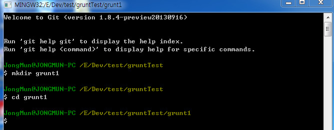
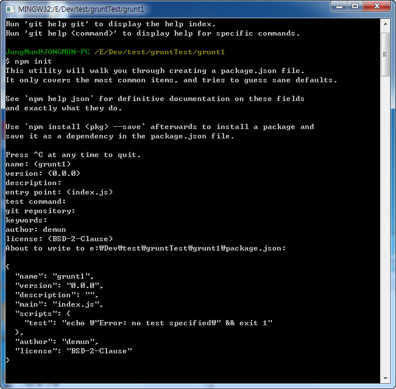

# Grunt 사용법

grunt 의 자세한 사용법은 홈페이지나 번역된 사이트를 참고하시기 바랍니다.    
버젼에 따라 사용하는 방법이 약간식 다를수 있습니다. 	
여기서는 제가 사용한 사용법을 기술합니다.

> [grunt](http://gruntjs.com/) 	
> [grunt 번역](http://gurntjs-kr.herokuapp.com/)


# Grunt 실행순서 및 사용법

홈페이지의 내용을 읽어보고 순서에 맞게 실행이 되는지 테스트해보고, 그 내용을 적었습니다.


### grunt 를 사용하기 위해서는 node.js가 설치되어 있어야 한다. 		
node.js => [http://nodejs.org/](http://nodejs.org/)

또는 `node -v` 를 입력해서 버젼을 알아보는 것도 한 방법이다. 		
설치되어 있다면 버젼을 보여줄것이다. 	


### grunt-cli 설치. 		

제일먼저 할것은 `grunt-cli` 를 설치하는것이다. 

이것은 아무 위치(폴더)에서나 실행해도 된다.

```
npm install -g grunt-cli
```


### 프로젝트 폴더 만들기.


프로젝트 폴더를 만들고 그 안에서 명령을 실행한다.

git 을 사용함으로 저는 아래와 같은 코드로 grunt1 폴더를 만들었습니다.

```
mkdir grunt1
cd grunt1
```




### npm init

```
npm init
```

위 코드를 치면기본 사항을 물어온다.
> name: <grunt1> - 프로젝트명이 자동으로 입력되어 있다. 		
> version: <0.0.0> 		
> description:  		
> entry point: <index.js> 			
> test command: 		
> git repository:  		
> keywords: 		
> author: demun - 대문이라고 입력해봤습니다. 			
> license: <BSD-2-Clause> 			
> Is this ok? <yes> 			


여기까지 진행하면 package.json 파일이 만들어진다. 	



현재까지 만들어진 package.json 코드는 아래와 같다.

```
{
  "name": "grunt1",
  "version": "0.0.0",
  "description": "",
  "main": "index.js",
  "scripts": {
    "test": "echo \"Error: no test specified\" && exit 1"
  },
  "author": "demun",
  "license": "BSD-2-Clause"
}
```


### npm install grunt --save-dev

grunt 와 플러그인을 설치와 동시에 package.json과 연동시키려면 아래 코드를 입력해야 한다.


```
npm install grunt --save-dev
```

이 구문을 실행시키면 node_modules 폴더와 파일들이 생성되는것을 알 수 있다.  
또한 `package.json` 파일에 `devDependencies` 항목이 추가된다.

위 구문을 실행하면 `package.json` 에 `"grunt": "~0.4.2"` 구문이 추가된것을 알 수 있다.

즉 `Grunt`를 설치와 동시에 `package.json`에 자동으로 구문이 추가되어 연동치키려면 `npm install <module> --save-dev` 구문을 사용하면 된다.


### [grunt-contrib-uglify](https://npmjs.org/package/grunt-contrib-uglify) 모듈 사용해보기

uglify 는 파일의 용얄을 작게 해주는 플러그인이다. 		
설치방식은 위에서 말한것처럼 `npm install <module> --save-dev` 형식으로 설치하면 된다.

```
npm install grunt-contrib-uglify --save-dev
```

위에서 말했듯 `package.json` 에 `"grunt-contrib-uglify": "~0.2.7"` 구문이 자동으로 추가되었다.
`uglify` 모듈을 설치했으니 `Gruntfile.js` 를 만들고 설정해보자.


### Gruntfile.js

`Gruntfile.js` 를 만들고 아래처럼 입력합니다. 		

```
module.exports = function(grunt) {

  // 프로젝트 환경설정.
  grunt.initConfig({
    pkg: grunt.file.readJSON('package.json'),
    uglify: {
      options: {
        banner: '/*! <%= pkg.name %> <%= grunt.template.today("yyyy-mm-dd") %> */\n'
      },
      build: {
        src: 'src/<%= pkg.name %>.js',
        dest: 'build/<%= pkg.name %>.min.js'
      }
    }
  });

  // "uglify" task를 지원하는 플러그인 로드.
  grunt.loadNpmTasks('grunt-contrib-uglify');

  // Default task(s).
  grunt.registerTask('default', ['uglify']);

};
```


#### Gruntfile.js 설명

`options` 은 옵션으로 해당 프로젝트명이 들어가고, 날짜가 주석으로 들어간다.

build 폴더에 옵션이 있다.
`src: 'src/<%= pkg.name %>.js',` 는 소스파일이다. 프로젝트명으로 된 js 를 사용한다는 의미다.
`dest: 'build/<%= pkg.name %>.min.js'` 는 dest 는 목적지 즉 결과를 말한다.  		
위의 소스파일을 build 폴더에 프로젝트.min.js 로 생성한다는 의미다.


### grunt

```
grunt
```


`Gruntfile.js` 맨 아래구문을 보면 `grunt.registerTask('default', ['uglify']);` 있다.
기본적으로 `grunt` 라고 입력하면 `default` 가 실행이 된다.


이제 첫번째 모듈인 `uglify` 를 사용하는 방법을 알아봤다.
다른 모듈도 사용법은 비슷하다.


> `Gruntfile` 설정은 좀더 알아볼 필요가 있다. 홈페이지를 참고하기 바란다.


----------------------------------


해당 폴더에 어떤 플러그인을 설치하고 사용하였는지 해당폴더의 readme.md 를 확인하면 된다.
여기서는 모듈을 설치한 순서대로 폴더명을 나열한다.

> 작성중


