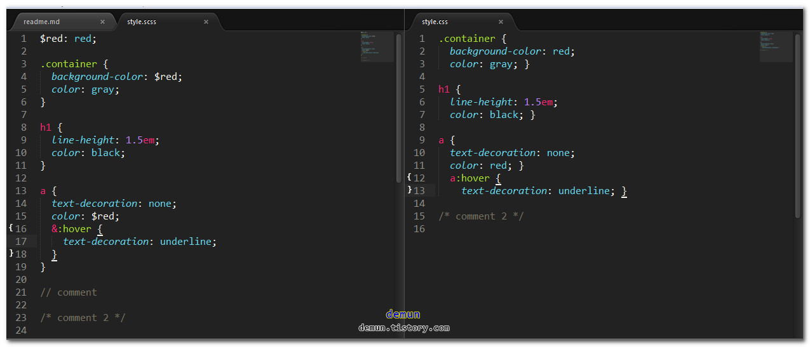
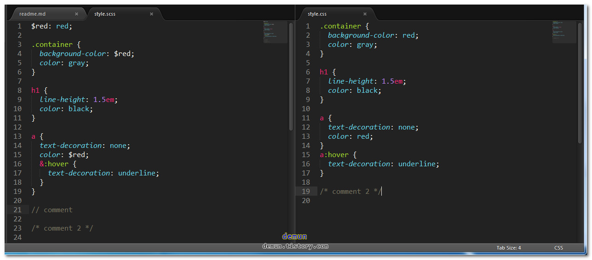
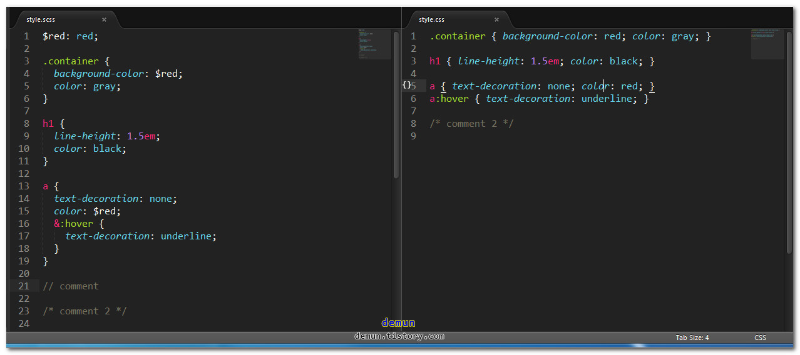
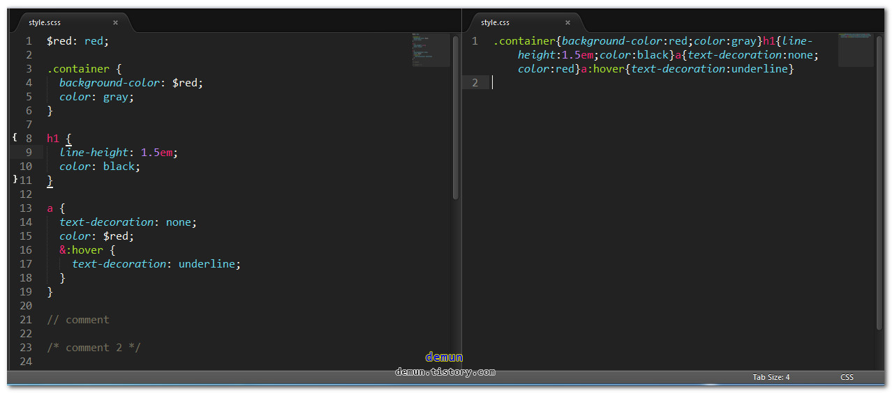
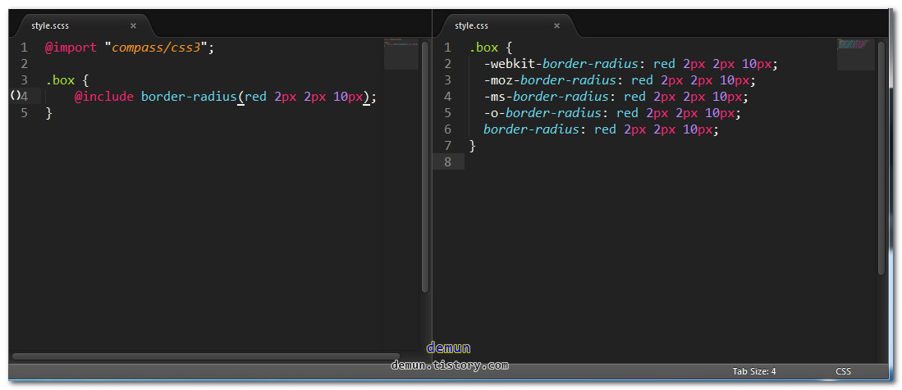

# Sass

[Sass](http://sass-lang.com/)
[RubyGems](http://rubygems.org/)


## 설치 및 컴파일

```
gem install sass


// scss 를 css 로 컴파일
sass style.scss:style.css

// 동기화시켜 컴파일하기
sass --watch style.scss:style.css

// 기본으로 nested 스타일로 컴파일한다 아래는 expanded
sass style.scss:style.css --style expanded

// 실무에서 자주 사용하는 compact
sass style.scss:style.css --style compact

// 압축할때는 compressed
sass style.scss:style.css --style compressed
```

## nested


## expanded


## compact


## compressed



----------------------------------


# compass

[compass](http://compass-style.org/) 

```
// compass 설치
gem install compass

// 동기화하고, expanded 스타일로 컴파일
sass --compass --watch style.scss:style.css --style expanded
```

# expanded


# css3



