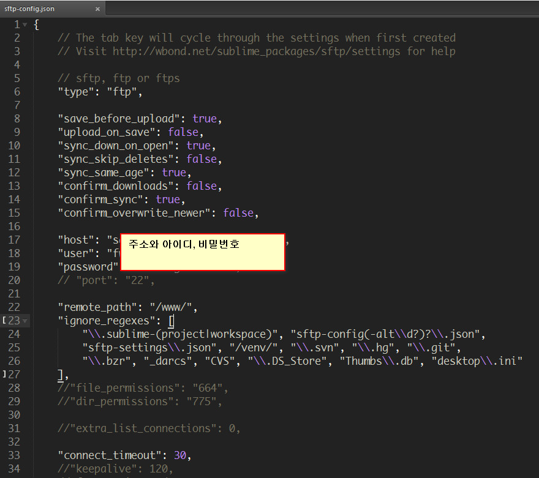

# Sublime text 폴더에 대한 설명

서브라임텍스트에 관련한 파일과 설정들입니다. 	
사용하다가 필요한다고 생각되는것들을 하나씩 모아둔 것입니다.

## Knowhow

서브라임텍스트 팁이 있는 폴더입니다. 
> readme.md 에는 단축키에 대한 글이 있습니다.

shortcuts.html 은 현재 작성하기 위해 업로드 해놓은 파일-참고파일입니다.

## LESS-build
빌드에 필요한 설정파일이 있습니다.
> less 파일 폴더위에 CSS폴더에 CSS파일이 빌드되도록 설정했습니다.

## Jade Build
빌드에 필요한 설정파일이 있습니다.
> Jade 파일 폴더위에 html폴더에 html파일이 빌드되도록 설정했습니다.

## SASS Build
빌드에 필요한 설정파일이 있습니다.
> SASS 파일 폴더위에 CSS폴더에 CSS파일이 빌드되도록 설정했습니다.

## User
> user 폴더 : Sublime Text 2\Packages\User 폴더입니다.  	
> user 폴더 안에는 서브라임 텍스트의 플러그인을 설치한다음 이용할 수 있는 것이 있을수 있고, 그냥 이용할 수 있는것도 있습니다.

- Preferences.sublime-settings
현재 사용하고 있는 서브라임텍스트의 설정입니다.  	
주석이 포함되어 있으니 원하는 형식만 사용하시면 됩니다.

- Default (Windows).sublime-keymap
현재 사용하고 있는 서브라임텍스트의 단축키입니다.  			
마찬가지로 주석이 포함되어 있으니 원하는 형식만 사용하시면 됩니다.

- snippet 폴더
제가 사용하고 있는 주석 등 snippet 입니다.

- SideBarEnhancements 폴더
사이드바 확장 플러그인에서 설정에 대한 부분이 들어있습니다.

## 기타
demun.sublime-project 파일은 프로젝트 설정파일입니다.  			
자주 사용하는 구문이여서 추가해서 사용하고 있습니다.

## images
기타 설명에 필요한 이미지 폴더

------------------------------------

# sftp
셋팅에 필요한 파일

