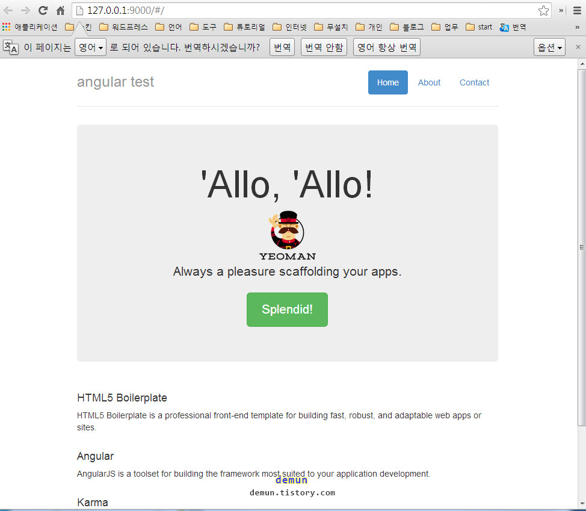

# Ember.js Generator Guide

ember generator 은 [generator-angular](https://github.com/yeoman/generator-angular) 를 참고하기 바란다.


Yeoman 에 대한 글을 위 폴더에 글을 참고. 		
yeoman .... 등등 모두 설치되어 있다고 가정. 		
설치 및 사용방법은 매우 간단하다. 		


```
npm install -g generator-angular

// 프로젝트 폴더 만들고 그 폴더안에서 실행
yo angular

// Would you like to use Sass? (Y/n)
y

// Would you like to include Twitter Bootstrap? (Y/n)
y

// Would you like to use the Sass version of Twitter Bootstrap? (Y/n)
y

// Which modules would you like to include? (Press <space> to select)
// 여기서는 angular-cookies.js 선택

// angular-resource.js
angular-cookies.js
// angular-sanitize.js
// angular-route.js


// 해당 모듈을 다운로드 받는다. 시간이 좀 걸린다.

grunt server
```

아래는 grunt server 를 실행한후 스샷



