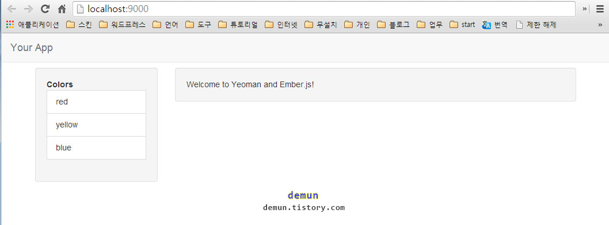

# Ember.js Generator Guide

ember generator 은 [generator-ember](https://github.com/yeoman/generator-ember) 과 [Yeoman Ember Tutorial](https://www.openshift.com/blogs/day-24-yeoman-ember-the-missing-tutorial) 를 참고하기 바란다.


Yeoman 에 대한 글을 위 폴더에 글을 참고. 		
yeoman .... 등등 모두 설치되어 있다고 가정. 		
설치 및 사용방법은 매우 간단하다. 		


```
npm install -g generator-ember

// 프로젝트 폴더 만들고 그 폴더안에서 실행
yo ember

// Would you like to include Twitter Bootstrap for Sass? (Y/n)
y


grunt server
```

아래는 grunt server 를 실행한후 스샷



