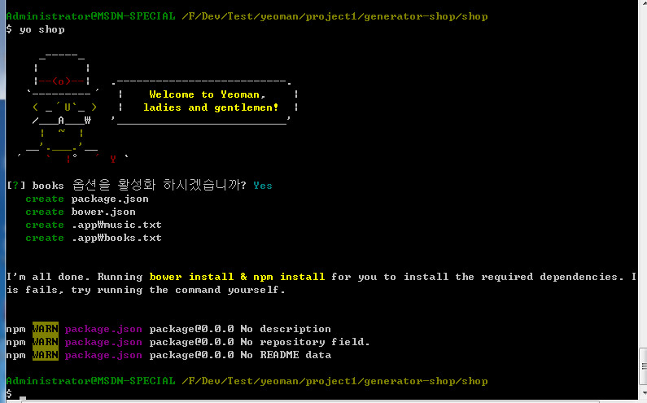
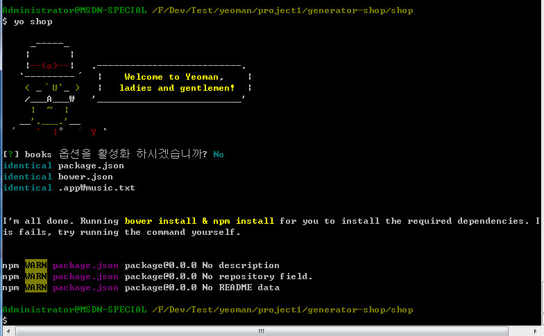
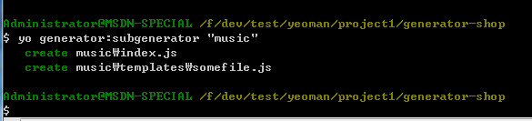
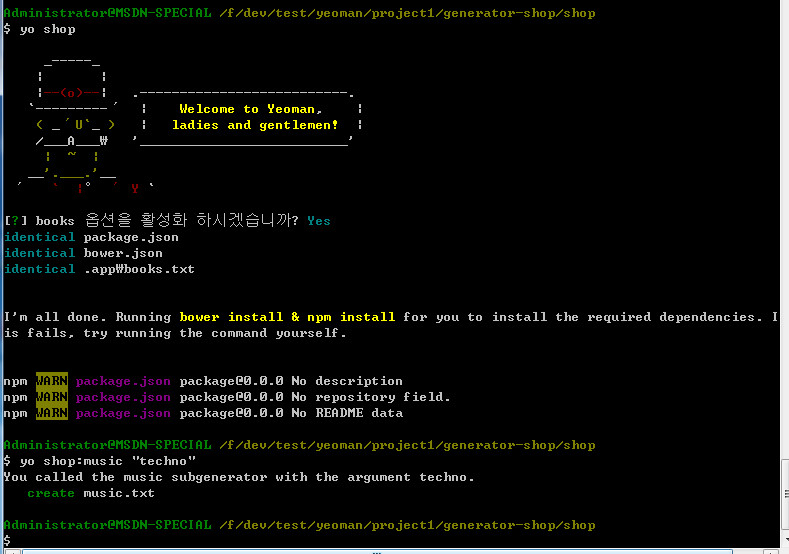
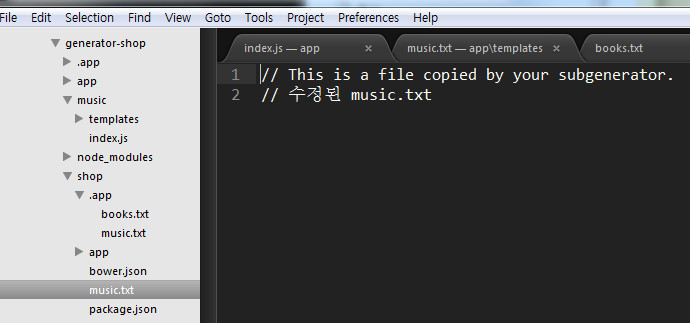
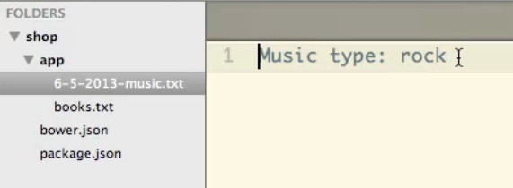

# [YEOMAN](http://yeoman.io/)

yeoman 을 사용하기 위해서는 [node.js](http://nodejs.org/) , [git](http://git-scm.com/) , [ruby](https://www.ruby-lang.org/ko/) , [compass](http://compass-style.org/install/) 등이 미리 설치되어 있어야 한다.

설치방법은 각 사이트 참고.

> 아래의 내용은 길다. 		
> 사용방법에 대한글이 사용순서와 일치한다.  		
> 또한 옵션까지 수정하고 수정된 옵션을 적용하는 방법까지 적혀있다.  


```
npm install -g yo
npm install -g generator-webapp
yo webapp
// bootstrap
// Mordernizr 등 선택하는 화면 나오고 화살표로 원하는 모듈 선택

// grunt server 를 하기전 루비 및 compass가 설치되어있는지 확인
// 없다면 설치, compass 설치는
gem update --system
gem install compass


grunt server
// index 파일열림.
// 파일 수정 등 작업

grunt
```


## yeoman 설치 및 사용순서

아래의 순서대로 설치하거나 진행해야 된다.


### 1. yeoman 설치

yeoman 을 먼저 설치한다.

```
npm install -g yo
```


### 2. generator 설치

generator 을 설치하면 yeoman의 모든 플러그인을 설치하게 된다.

```
npm search yeoman-generator
```

### 3. webapp 설치


```
npm install generator-webapp
```


### 4. 프로젝트 폴더 생성
기본적인 설치는 끈이나고 프로젝트를 질행할 폴더를 생성하고 그 안에 들어가서 작업을 한다.

```
mkdir project1
cd project1
```


### 5. 프로젝트 실행


```
yo webapp
```

위 구문을 실행하면 요만의 로고가 나오며 프로젝트 실행을 알린다.   
bootstrap, modernizr, sass ... 등등을 프로젝트에 포함할거냐고 물어온다.   

y 또는 엔터를 치면 관련 파일과 프로젝트 파일등을 다운로드한다.  
관련 파일은 Gruntfile.js 를 비롯해서, livereload,compass..등이 포함되어 있다.

이 파일은 기본셋팅 파일들의 모음이고 grunt를 실행해야 완성된다.


## 6. Grunt 실행

```
grunt server
```

위 구문을 실행하면 자동으로 localhost:9000 으로 html 이 브라우져로 열린다. 		

app 폴더의 index.html 파일이 브라우져로 열린다. 		
여기까지 한 다음 파일(html,sass,js....)등을 수정하면 바로 감지해서 컴파일하여 실시간으로 보여준다.


## 7. minify 빌드하기
현재까지 진행하면 test 폴더가 만들어지고 그 안에 관련파일들이 있다.

```
grunt test
```

test 로 프로젝트가 진행이 되며 localhost:9001/index.html 이 추가되었다고 나온다. 			
하지만 관련 파일들이 제대로 로드가 되지 않으며 `grunt` 를 실행해서 관련 파일들이 준비가 되게 해줘야 한다.

## 8. grunt

```
grunt
```

grunt 를 실행하면 dist라는 폴더가 생성이 되고 그 안에 병함된(minify) 파일들이 만들어진게 된다.


> 여기까지가 공식적인 순서이다.
> 옵션이 적용된것을 빌드하거나 새로운  옵션을 만드는 과정은 이후 계속된다.


# generator 생성해서 새 프로젝트 만들기.

```
npm install -g generator-generator
```


## generator shop 프로젝트

```
mkdir generator-shop
cd generator-shop
```

generator-shop 폴더 생성
generator-shop 폴더안으로 들어가기


## yo generator 생성


```
yo generator
```

위 구문을 실행하면 각종 준비파일을 사용할거냐 물어온다.
github에 사용할 이름?
generator에 사용할 이름? 기본으로 위에서 지정한 shop 가 지정되어 있다. 


## 1. shop 프로젝트 진행

```
yo shop
```

shop 프로젝트 진행할려고하면 이제 옵션을 활성화 할거냐고 물어온다.  		
엔터지면 각종 파일 package.json, bower.json ... 등등 파일들이 만들어진다.

여기까지 진행하면 generator-shop 폴더안에 app 폴더안에 index.js 파일이 만들어지는데 이것이 옵션파일이다.

이 파일을 수정 즉 커스터마이징하여 사용한다. 

기본 index.js 와 수정된 index.js 를 비교해본다.


기본 index.js 파일은 아래와 같다.

```js
'use strict';
var util = require('util');
var path = require('path');
var yeoman = require('yeoman-generator');


var ShopGenerator = module.exports = function ShopGenerator(args, options, config) {
  yeoman.generators.Base.apply(this, arguments);

  this.on('end', function () {
    this.installDependencies({ skipInstall: options['skip-install'] });
  });

  this.pkg = JSON.parse(this.readFileAsString(path.join(__dirname, '../package.json')));
};

util.inherits(ShopGenerator, yeoman.generators.Base);

ShopGenerator.prototype.askFor = function askFor() {
  var cb = this.async();

  // have Yeoman greet the user.
  console.log(this.yeoman);

  var prompts = [{
    type: 'confirm',
    name: 'someOption',
    message: 'would you like to enable this option?',
    default: true
  }];

  this.prompt(prompts, function (props) {
    this.someOption = props.someOption;

    cb();
  }.bind(this));
};

ShopGenerator.prototype.app = function app() {
  this.mkdir('app');
  this.mkdir('app/templates');

  this.copy('_package.json', 'package.json');
  this.copy('_bower.json', 'bower.json');
};

ShopGenerator.prototype.projectfiles = function projectfiles() {
  this.copy('editorconfig', '.editorconfig');
  this.copy('jshintrc', '.jshintrc');
};
```


변경후

- app/templates/editorconfig
- app/templates/jshintrc
- app/templates/travis.yml
등을 관련없는 템플릿 파일등을 삭제하고 index.js도 수정해본다. 		
또한 books.txt 나 music.txt 등 파일들도 추가해본다


```js
'use strict';
var util = require('util');
var path = require('path');
var yeoman = require('yeoman-generator');


var ShopGenerator = module.exports = function ShopGenerator(args, options, config) {
  yeoman.generators.Base.apply(this, arguments);

  this.on('end', function () {
    this.installDependencies({ skipInstall: options['skip-install'] });
  });

  this.pkg = JSON.parse(this.readFileAsString(path.join(__dirname, '../package.json')));
};

util.inherits(ShopGenerator, yeoman.generators.Base);

ShopGenerator.prototype.askFor = function askFor() {
  var cb = this.async();

  // have Yeoman greet the user.
  console.log(this.yeoman);

  var prompts = [{
    type: 'confirm',
    name: 'includeBooks',
    message: 'books 옵션을 활성화 하시겠습니까?',
    // default: true
    default: 'Y/n'
  }];

  this.prompt(prompts, function (props) {
    this.includeBooks = props.includeBooks;

    cb();
  }.bind(this));
};

ShopGenerator.prototype.app = function app() {
  this.mkdir('app');

  this.copy('_package.json', 'package.json');
  this.copy('_bower.json', 'bower.json');
};

ShopGenerator.prototype.projectfiles = function projectfiles() {
  this.copy('music.txt', '.app/music.txt');
  if(this.includeBooks) {
  	this.copy('books.txt', '.app/books.txt');
  }
};
```


## 2. 수정된 옵션의 shop 프로젝트 실행

```
yo shop
```

index.js 를 수정한후 shop프로젝트를 다시 실행해본다. 	
진행사항은 아래의 이미지 참고. 		 		




위는 새로 생성한 music.txt와 books.txt 등 모두 새로 생성했다. 옵션에서 `y` 를 입력했기 때문이다.

만약 옵션을 활성화하지 않기위해 `n` 을 입력하면 아래처럼 보인다.




## 새 폴더 추가하기

```
yo generator:subgenerator "music"
```

generator-shop 폴더에서 새폴더인 music 폴더를 생성한다.  			
그럼 새로운 폴더가 생성이 된다.




music 폴더에 있는 index.js 파일

```js
'use strict';
var util = require('util');
var yeoman = require('yeoman-generator');

var MusicGenerator = module.exports = function MusicGenerator(args, options, config) {
  // By calling `NamedBase` here, we get the argument to the subgenerator call
  // as `this.name`.
  yeoman.generators.NamedBase.apply(this, arguments);

  console.log('You called the music subgenerator with the argument ' + this.name + '.');
};

util.inherits(MusicGenerator, yeoman.generators.NamedBase);

MusicGenerator.prototype.files = function files() {
  this.copy('somefile.js', 'somefile.js');
};
```

변경한 index.js

- music 폴더의 index.js 에서 `somefile.js` 를 `music.txt` 로 변경
- templates 폴더의 `somefile.js` 를 `music.txt` 로 변경
- 위에서 사용했던 상위폴더인 app 폴더 index.js 에서 `this.copy('music.txt', '.app/music.txt');` 주석처리


```js
'use strict';
var util = require('util');
var yeoman = require('yeoman-generator');

var MusicGenerator = module.exports = function MusicGenerator(args, options, config) {
  // By calling `NamedBase` here, we get the argument to the subgenerator call
  // as `this.name`.
  yeoman.generators.NamedBase.apply(this, arguments);

  console.log('You called the music subgenerator with the argument ' + this.name + '.');
};

util.inherits(MusicGenerator, yeoman.generators.NamedBase);

MusicGenerator.prototype.files = function files() {
  this.copy('music.txt', 'music.txt');
};
```

위처럼 모두 변경한후 아래 구문 다시 실행

```
yo shop
```

새로운 빌드를 한다.
shop 폴더로 간다.

```
yo shop:music "techno"
```

shop 폴더에는 새로운 music.txt 가 생성이되고 새로운 옵션이 적용이 된다.

 



## index.js 수정

위까지 한다음 한번더 수정한다.

index.js 파일은 아래와 같다.

```js
'use strict';
var util = require('util');
var yeoman = require('yeoman-generator');

var MusicGenerator = module.exports = function MusicGenerator(args, options, config) {
  // By calling `NamedBase` here, we get the argument to the subgenerator call
  // as `this.name`.
  yeoman.generators.NamedBase.apply(this, arguments);

  console.log('You called the music subgenerator with the argument ' + this.name + '.');
};

util.inherits(MusicGenerator, yeoman.generators.NamedBase);

MusicGenerator.prototype.files = function files() {
  var today = new Date();
  var prefix = today.getUTCMonth() + 1;
  prefix += '-' + today.getDate();
  prefix += '-' + today.getFullYear();

  var filename = prefix + '-music.txt';
  this.write('app/' + filename, 'Music type: '+ this.name);
};
```

수정된 부분은 `MusicGenerator.prototype.files` 이다.
그리고 아래처럼 실행한다.

```
yo shop:music "rock"
```

그러면 위처럼 수정된 옵션을 적용해서 파일이 만들어진다.
동영상 파일의 이미지 참고




